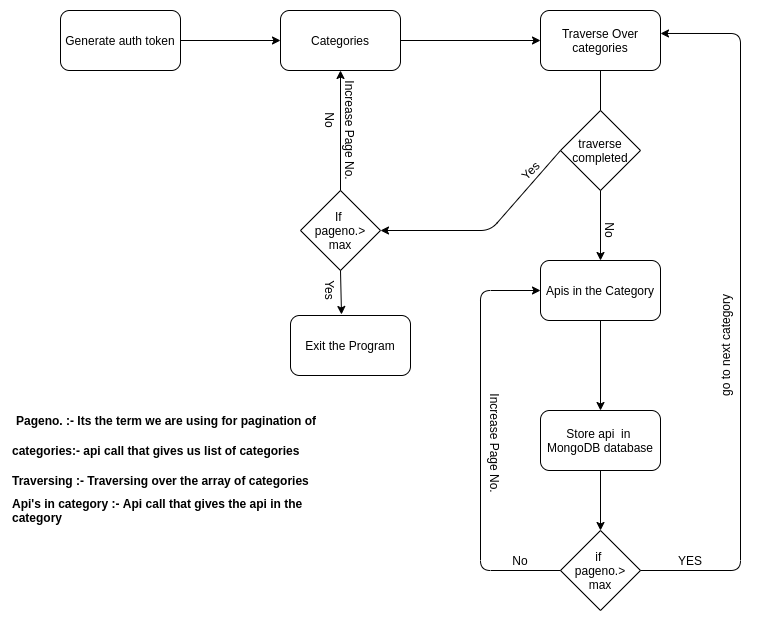

# Public api's detail to database


### A node js service .

## Features:
- This will iterate through all the available api in the [public api repo](https://github.com/public-apis/public-apis) using postman api
- It will handle keep in find the constarints like 10 request per minute and changing auth token after every 5 minute .

## Requirements:
- [Docker](https://www.python.org/downloads/)
- [MongoDB Atlas](https://www.docker.com/)

## How to run :
- **Step 1**:
    Clone the repo
    ```bash
    git clone https://github.com/WOLFIEEEE/postman_assessment.git
    ```
- **Step 2**:
    Create a free mongodb atlas account [steps](https://www.mongodb.com/cloud/atlas/register).

    It will take roughly around 3-4 minute ( sorry for that )

- **Secret step**:
    As the above step might consume time so I will be leaving my connection url in env only , just for the time being as this is private repo , you won't be able to see the data stored but you can run the application and check the working.

    If you wish to use this move directly to **step4** 

- **Step 3**;
    
    After setting up account and creating cluster . 

    - click on connect 
    -  click on connect with application 
    -  You will get a url copy the url and paster it in [env.json](https://github.com/WOLFIEEEE/postman_assessment/blob/main/env.json)

    ```json
    {
    "database_uri":"mongodb_url",
    "database_name":"Postman_Assessment",
    }
    ```

    Don't forget to repalce the **<** **passowrd>**  with  your own password.

## - Using docker
- **Step 4**
    In windows
     ```bash
    docker-compose up --build 
    ```
    In Linux based operating system 
     ```bash
    sudo docker-compose up --build
    ```

## - Using npm
- **Step 4**
    to install all the packages
     ```bash
    npm install
    ```
    to run the application
     ```bash
    node server.js
    ```
##  Database Schema

We are creating a separate collection for every category in our monogodb database , as mongodb is not dependent on schema and we don't have much relationship in our data rather that category we will be going with default schema . 

```json
{
    _id : {type: ObjectId}
    API: { type: String},
    Description: { type: String},
    Auth:{type : String}
    HTTPS: { type: Boolean },
    Cors: { type: String},
    Link : {type: String},
    category:{type: String} 
}
```

Here's is the sample structure

```json
{
    "_id": {
        "$oid": "612bda30238707befe88af13"
    },
    "API": "IUCN",
    "Description": "IUCN Red List of Threatened Species",
    "Auth": "apiKey",
    "HTTPS": false,
    "Cors": "unknown",
    "Link": "http://apiv3.iucnredlist.org/api/v3/docs",
    "Category": "Animals"
}
```

    


## Flow of Code:
<p align="center">
  
</p>

## Improvement for future

- Adding mongodb locally with node js in the same docker(wasn't able to achive that cause of time constraints)
- Improving writability of my code I tried to make it as easy to understand as I could but it's still not enough I guess.
- Utilising the concepts of OOPs , I have applied the conecpt of OOPs but I wasn't able to full utilise them .

    


